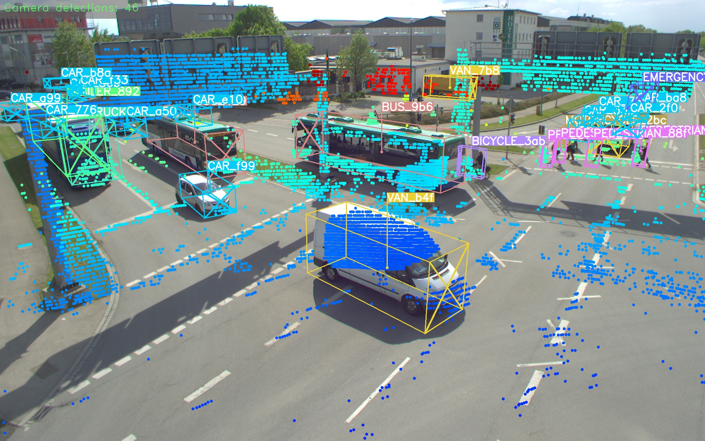
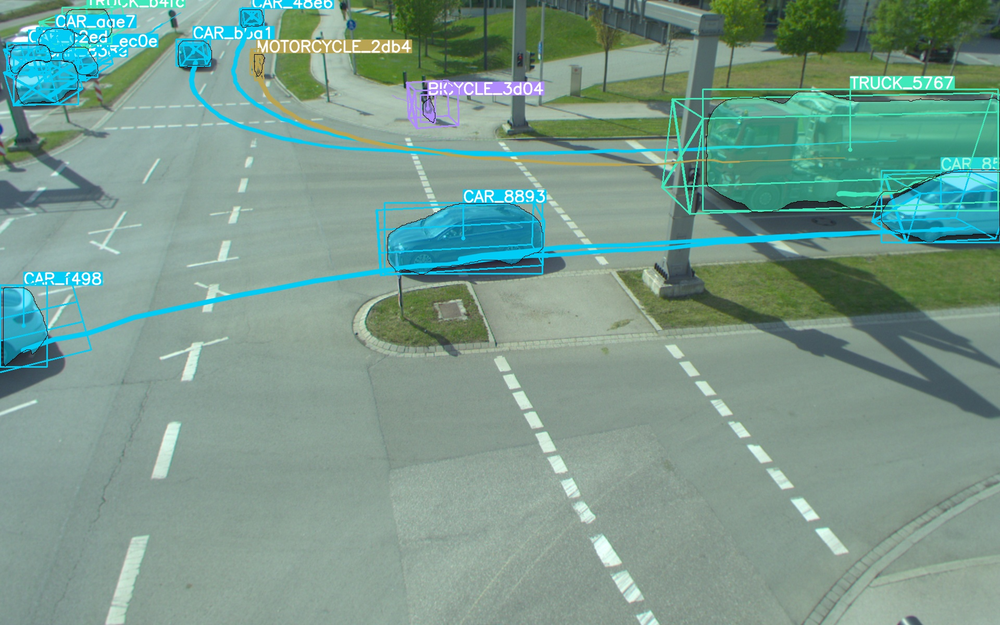
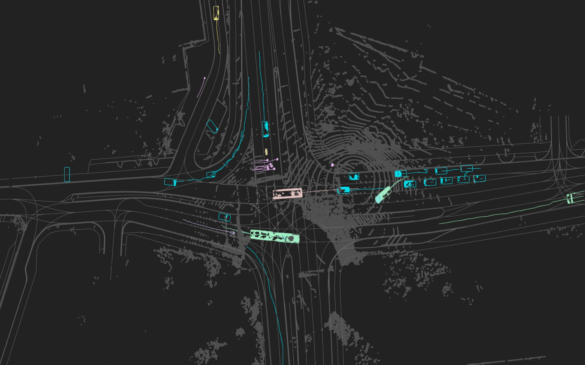
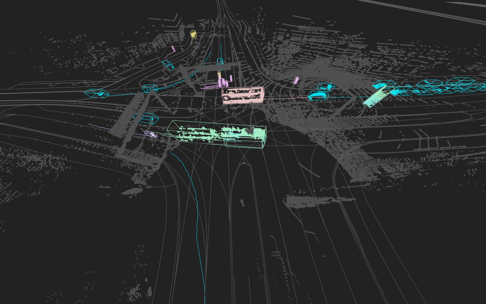
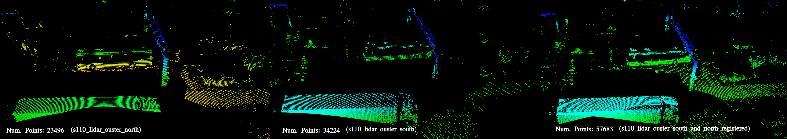
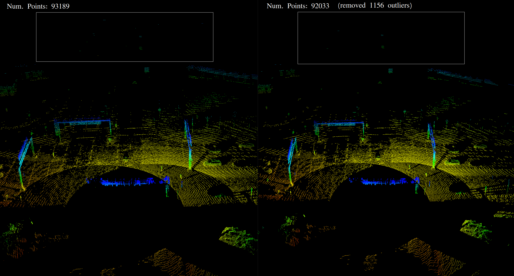

# 🔧 TUM Traffic Dataset Development Kit 🔨

 🚀 The [TUM Traffic Dataset](https://innovation-mobility.com/tumtraf-dataset) (`TUMTraf`) is based on roadside sensor data from the 3 km long [Providentia Test Field for Autonomous Driving](https://innovation-mobility.com/en/project-providentia/) near Munich in Germany. The dataset includes anonymized and precision-timestamped multi-modal sensor and object data in high resolution, covering a variety of traffic situations. We provide camera and LiDAR frames from overhead gantry bridges with the corresponding objects labeled with 3D bounding boxes and track IDs. The dataset contains the following subsets:
- [[DOWNLOAD]](https://a9-dataset.com) TUMTraf A9 Highway Dataset (`TUMTraf-A9`)
- [[DOWNLOAD]](https://innovation-mobility.com/tumtraf-dataset) TUMTraf Intersection Dataset (`TUMTraf-I`)
- [[DOWNLOAD]](https://innovation-mobility.com/tumtraf-dataset) TUMTraf Event Dataset (`TUMTraf-E`)
- [[DOWNLOAD]](https://innovation-mobility.com/tumtraf-dataset) TUMTraf V2X Cooperative Perception Dataset (`TUMTraf-V2X`)

# ✨ Overview
- [News](#news)
- [Release History](#release-history)
- [Installation](#installation)
- [Dataset Structure](#dataset-structure)
- [Label Visualization](#label-visualization)
- [Data Split](#data-split)
- [Point Cloud Registration](#point-cloud-registration)
- [Data Cleaning](#data-cleaning)
- [Label Conversion](#label-conversion)
- [Evaluation](#evaluation)
- [Acknowledgements](#acknowledgements)
- [Citation](#citation)
- [License](#license)
- [Contact](#contact)

The Development Kit provides a dataset loader for images, point clouds, labels and calibration data. The calibration loader reads the intrinsic and extrinsic calibration information. The projection matrix is then used to visualize the 2D and 3D labels on cameras images. 

## 📢 News
- 2024/03: Final version of TUMTraf dev-kit released (v1.0.0)
- 2024/02: Accepted paper at CVPR'24 conference: [TUMTraf V2X Cooperative Perception Dataset](https://arxiv.org/pdf/2403.01316.pdf)
- 2023/12: Added instance segmentation labels to TUMTraf Intersection Dataset (`TUMTraf-I`)
- 2023/11: Finished annotation of [TUMTraf V2X Cooperative Perception Dataset](https://tum-traffic-dataset.github.io/tumtraf-v2x/)
- 2023/09: 🏆 [IEEE Best Student Paper Award](https://2023.ieee-itsc.org/best-paper-awards/) at the ITSC'23 conference: [TUMTraf Intersection Dataset: All You Need for Urban 3D Camera-LiDAR Roadside Perception](https://ieeexplore.ieee.org/document/10422289)
- 2022/08: Introduced OpenLABEL annotation format and created converters (dev-kit v0.2.0) 
- 2022/04: Accepted paper at IV'22 conference: [A9-Dataset: Multi-Sensor Infrastructure-Based Dataset for Mobility Research](https://ieeexplore.ieee.org/document/9827401)
- 2022/02: Finished annotation of [TUMTraf A9 Highway Dataset](https://innovation-mobility.com/en/project-providentia/a9-dataset/) using [3D BAT](https://github.com/walzimmer/3d-bat) labeling tool
- 2021/12: First release of the dev-kit (v0.1.0)


## 🔥 Release History
The TUM Traffic Dataset contains the following releases:
* 2024-XX: Planning to release R06 TUMTraf Accident Dataset (`TUMTraf-A`)
* 2024-02: Released R05 TUMTraf Intersection Extended Dataset (`TUMTraf-IE`) 
* 2024-02: Released R04 TUMTraf V2X Cooperative Perception Dataset (`TUMTraf-V2X`)
* 2023-12: Released R03 TUMTraf Event Dataset (`TUMTraf-E`) 
* 2023-06: Released R02 TUMTraf Intersection Dataset (`TUMTraf-I`) 
* 2022-07: Released R01 TUMTraf A9 Highway Extended Dataset (`TUMTraf-A9E`)
* 2022-04: Released R00 TUMTraf A9 Highway Dataset (`TUMTraf-A9`)  


 

## 💾 Installation
Create an anaconda environment:
```
conda create --name tum-traffic-dataset-dev-kit python=3.9
conda activate tum-traffic-dataset-dev-kit
```
Install the following dependencies:
```
conda install -c conda-forge fvcore
conda install -c conda-forge iopath
```
In case, you are using NVIDIA CUDA <11.6:
```
curl -LO https://github.com/NVIDIA/cub/archive/1.10.0.tar.gz
tar -xzf 1.10.0.tar.gz
export CUB_HOME=$PWD/cub-1.10.0
```
Install PyTorch3D:
```
pip3 install --no-index --no-cache-dir pytorch3d -f https://dl.fbaipublicfiles.com/pytorch3d/packaging/wheels/py39_cu113_pyt1121/download.html
```
Further information is available here: https://github.com/facebookresearch/pytorch3d/blob/main/INSTALL.md

Install requirements:

```
pip3 install -r requirements.txt
pip3 install --upgrade git+https://github.com/klintan/pypcd.git
```

Add dev kit's root directory to `PYTHONPATH`:
```
export PYTHONPATH=$PYTHONPATH:/home/<USERNAME>/tum-traffic-dataset-dev-kit/
```

## 📃  Dataset Structure
#### 1) TUM Traffic A9 Highway Dataset (`TUMTraf-A9`) 
The TUM Traffic A9 Highway Dataset (`TUMTraf-A9`) contains 5 subsets (`s00` to `s04`) and is structured in the following way:

The first 3 sets `tum_traffic_a9_r00_s00`, `tum_traffic_a9_r00_s01` and `tum_traffic_a9_r00_s02` contain image data (`.png`) from roadside cameras with corresponding label files (stored in OpenLABEL `.json` format) and calibration data:
``` 
├── tum_traffic_a9_dataset_r00_s00
│   ├── _images
│   │   ├── s040_camera_basler_north_16mm
│   │   ├── s040_camera_basler_north_50mm
│   │   ├── s050_camera_basler_south_16mm
│   │   ├── s050_camera_basler_south_50mm
│   ├── _labels
│   │   ├── s040_camera_basler_north_16mm
│   │   ├── s040_camera_basler_north_50mm
│   │   ├── s050_camera_basler_south_16mm
│   │   ├── s050_camera_basler_south_50mm
│   ├── _calibration
│   │   ├── s040_camera_basler_north_16mm.json
│   │   ├── s040_camera_basler_north_50mm.json
│   │   ├── s050_camera_basler_south_16mm.json
│   │   ├── s050_camera_basler_south_50mm.json
```

The last two sets `tum_traffic_a9_r00_s03`, and `tum_traffic_a9_r00_s04` contain point cloud data (`.pcd`) from roadside LiDARs with corresponding label files (stored in OpenLABEL `.json` format) and calibration data:
``` 
├── tum_traffic_a9_dataset_r00_s03
│   ├── _points
│   ├── _labels
```


#### 2) TUM Traffic A9 Highway Extended Dataset (`TUMTraf-A9E`)
The extended TUM Traffic A9 Highway Dataset additionally contains 3 subsets (`s01` to `s03`) and is structured in the following way:

Example: tum_traffic_a9_dataset_r01_s01:
``` 
├── tum_traffic_a9_dataset_r01_s03
│   ├── _images
│   │   ├── s040_camera_basler_north_16mm
│   │   ├── s040_camera_basler_north_50mm
│   │   ├── s050_camera_basler_south_16mm
│   │   ├── s050_camera_basler_south_50mm
│   ├── _labels
│   │   ├── s040_camera_basler_north_16mm
│   │   ├── s040_camera_basler_north_50mm
│   │   ├── s050_camera_basler_south_16mm
│   │   ├── s050_camera_basler_south_50mm
│   ├── _calibration
│   │   ├── s040_camera_basler_north_16mm.json
│   │   ├── s040_camera_basler_north_50mm.json
│   │   ├── s050_camera_basler_south_16mm.json
│   │   ├── s050_camera_basler_south_50mm.json
```

#### 3) TUM Traffic Intersection Dataset (`TUMTraf-I`)
The TUM Traffic Intersection Dataset (`TUMTraf-I`) contains 4 subsets (`s01` to `s04`) and is structured in the following way:

``` 
├── tum_traffic_intersection_dataset_r02_s01
│   ├── _images
│   │   ├── s110_camera_basler_south1_8mm
│   │   ├── s110_camera_basler_south2_8mm
│   ├── _labels
│   │   ├── s110_lidar_ouster_south
│   │   ├── s110_lidar_ouster_north
│   ├── _points_clouds
│   │   ├── s110_lidar_ouster_south
│   │   ├── s110_lidar_ouster_north
├── tum_traffic_intersection_dataset_r02_s02
│   ├── ...
├── tum_traffic_intersection_dataset_r02_s03
│   ├── ...
├── tum_traffic_intersection_dataset_r02_s04
│   ├── ...
```

#### 4) TUM Traffic Event Dataset (`TUMTraf-E`)
The TUM Traffic Event Dataset (`TUMTraf-E`) contains 1 subsets (`s01` to `s04`) and is structured in the following way:

``` 
├── train
│   ├── _images
│   │   ├── eb
│   │   ├── eb_transformed
│   │   ├── rgb
│   │   ├── rgb_eb_combined
│   ├── _labels
│   │   ├── ...
├── val
│   ├── ...
├── test
│   ├── ...
├── calibration
│   ├── extrinsic
│   ├── intrinsic
```

#### 5) TUM Traffic V2X Cooperative Perception Dataset (`TUMTraf-V2X`)
The TUM Traffic V2X Cooperative Perception Dataset (`TUMTraf-V2X`) contains 10 sequences (`s01` to `s10`) and is structured in the following way:

``` 
├── train
│   ├── _images
│   │   ├── s110_camera_basler_south1_8mm
│   │   ├── s110_camera_basler_south2_8mm
│   │   ├── s110_camera_basler_east_8mm
│   │   ├── s110_camera_basler_north_8mm
│   │   ├── vehicle_camera_basler_16mm
│   ├── _labels_point_clouds
│   │   ├── s110_lidar_ouster_south_and_vehicle_lidar_robosense_registered
│   ├── _points_clouds
│   │   ├── s110_lidar_ouster_south
│   │   ├── s110_lidar_ouster_south_and_vehicle_lidar_robosense_registered
│   │   ├── vehicle_lidar_robosense
├── val
│   ├── ...
├── test
│   ├── ...

```


## 🎉 Label Visualization
### 1.1 Visualization of labels in camera images 
The following visualization script can be used to draw the 2D and/or 3D labels on camera frames:

```
python tum-traffic-dataset-dev-kit/src/visualization/visualize_image_with_3d_boxes.py --camera_id s110_camera_basler_south1_8mm \
                                                                                      --lidar_id s110_lidar_ouster_south \
                                                                                      --input_folder_path_images <IMAGE_FOLDER_PATH> \
                                                                                      --input_folder_path_point_clouds <POINT_CLOUD_FOLDER_PATH> \
                                                                                      --input_folder_path_labels <LABEL_FOLDER_PATH> \
                                                                                      --viz_mode [box2d,mask,box3d,point_cloud,track_history] \
                                                                                      --viz_color_mode [by_category,by_track_id] \
                                                                                      --output_folder_path_visualization <OUTPUT_FOLDER_PATH> \
                                                                                      --detections_coordinate_system_origin [s110_base,s110_lidar_ouster_south] \
                                                                                      --labels_coordinate_system_origin [s110_base,s110_lidar_ouster_south]
```

| Visualization south2 in camera:`--viz_mode box3d,point_cloud` | Visualization south1 camera: `--vis_mode box2d,box3d,mask,track_history` |
|---------------------------------------------------------------|------------------------------------------------------------------------|
<p float="left">
  
  
</p>

### 1.2 Visualization of labels in LiDAR point cloud scans
The script below draws labels on a LiDAR frame:

```
python tum-traffic-dataset-dev-kit/src/visualization/visualize_point_cloud_with_3d_boxes.py --input_folder_path_point_clouds <INPUT_FOLDER_PATH_POINT_CLOUDS> \
                                                                                          --input_folder_path_labels <INPUT_FOLDER_PATH_LABELS> \
                                                                                          --save_visualization_results \
                                                                                          --output_folder_path_visualization_results <OUTPUT_FOLDER_PATH_VISUALIZATION_RESULTS> \
                                                                                          --show_hd_map
```

Bird's Eye View            |  Side View
:-------------------------:|:-------------------------:
  |  

## ✴️️ Data Split

The script below splits the dataset into `train` and `val`:

```
python tum-traffic-dataset-dev-kit/src/preprocessing/create_train_val_split.py --input_folder_path_dataset <INPUT_FOLDER_PATH_DATASET> \
                                                                               --input_folder_path_data_split_root <INPUT_FOLDER_PATH_DATA_SPLIT_ROOT>
```
Example:
```
python tum-traffic-dataset-dev-kit/src/preprocessing/create_train_val_split.py --input_folder_path_dataset /home/<USERNAME>/tum_traffic_intersection_dataset_r02 \
                                                                               --input_folder_path_data_split_root <INPUT_FOLDER_PATH_DATA_SPLIT_ROOT> 
```

## ☁️ Point Cloud Registration

The following script can be used to register point clouds from two different LiDARs:
```
python tum-traffic-dataset-dev-kit/src/registration/point_cloud_registration.py --folder_path_point_cloud_source <INPUT_FOLDER_PATH_POINT_CLOUDS_SOURCE> \
                                                             --folder_path_point_cloud_target <INPUT_FOLDER_PATH_POINT_CLOUDS_TARGET> \
                                                             --save_registered_point_clouds \
                                                             --output_folder_path_registered_point_clouds <OUTPUT_FOLDER_PATH_POINT_CLOUDS>
```


## 🧹 Data Cleaning
A LiDAR preprocessing module reduces noise in point cloud scans:

```
python tum-traffic-dataset-dev-kit/src/preprocessing/remove_noise_from_point_clouds.py --input_folder_path_point_clouds <INPUT_FOLDER_PATH_POINT_CLOUDS> \
                                                                                       --output_folder_path_point_clouds <OUTPUT_FOLDER_PATH_POINT_CLOUDS>
```


## ⚡ Label Conversion
In addition, a data converter/exporter enables you to convert the labels from OpenLABEL format into other formats like KITTI, nuScenes, OpenPCDet, COCO or YOLO and the other way round. 


### OpenLABEL to YOLO
The following script converts the OpenLABEL labels into YOLO labels:
```
python tum-traffic-dataset-dev-kit/src/converter/conversion_openlabel_to_yolo.py --input_folder_path_labels <INPUT_FOLDER_PATH_LABELS> \
                                                                                 --output_folder_path_labels <OUTPUT_FOLDER_PATH_LABELS>
```

### OpenLABEL to KITTI
The following script converts the OpenLABEL labels into KITTI labels:
```
python tum-traffic-dataset-dev-kit/src/converter/conversion_openlabel_to_kitti.py --root-dir <DATASET_ROOT_DIR> \
                                                                                  --out-dir <OUTPUT_FOLDER_PATH_LABELS> \
                                                                                  --file-name-format [name,num]
```

### OpenLABEL to nuScenes
The following script converts the OpenLABEL labels into nuScenes labels:
```
python tum-traffic-dataset-dev-kit/src/converter/conversion_openlabel_to_nuscenes.py --root-path <DATASET_ROOT_DIR> \
                                                                                     --out-dir <OUTPUT_FOLDER_PATH_LABELS>
                                                                                 
```

## ⭐ Evaluation
Finally, some model evaluation scripts are provided to benchmark your models on the TUMTraf Dataset.

### 3D Object Detection Evaluation
Usage:
```
python tum-traffic-dataset-dev-kit/src/eval/evaluation.py --camera_id <CAMERA_ID> --file_path_calibration_data <FILE_PATH_CALIBRATION_DATA> --folder_path_ground_truth /path/to/ground_truth --folder_path_predictions /path/to/predictions --object_min_points 5 [--use_superclasses] --prediction_type lidar3d_supervised --prediction_format openlabel --use_ouster_lidar_only
```
Example:
```
python tum-traffic-dataset-dev-kit/src/eval/evaluation.py --camera_id s110_camera_basler_south1_8mm --file_path_calibration_data /home/user/tum-traffic-dataset-dev-kit/calib/s110_camera_basler_south1_8mm.json --folder_path_ground_truth /home/user/tum-traffic-intersection-dataset/test/labels_point_clouds --folder_path_predictions /home/user/tum-traffic-intersection-dataset/test/predictions --object_min_points 5 --prediction_type lidar3d_supervised --prediction_format openlabel --use_ouster_lidar_only
```

Data format of predictions can be KITTI or OpenLABEL.
1) KITTI format: One `.txt` file per frame with the following content (one line per predicted object): class x y z l w h rotation_z.<br>
Example:
```
Car 16.0162 -28.9316 -6.45308 2.21032 3.74579 1.18687 2.75634
Car 17.926 -19.4624 -7.0266 1.03365 0.97037 0.435425 0.82854
```

2) [OpenLABEL](https://www.asam.net/index.php?eID=dumpFile&t=f&f=3876&token=413e8c85031ae64cc35cf42d0768627514868b2f) format: One `.json` file per frame. 

Example call to compare one ground truth file with one prediction file visually:
```
python tum-traffic-dataset-dev-kit/src/eval/evaluation.py --folder_path_ground_truth ~/tum_traffic_a9_dataset_r01_test/labels/1651673050_454284855_s110_lidar_ouster_south.json \
                                                          --folder_path_predictions ~/predictions/1651673050_454284855_s110_lidar_ouster_south.json \ 
                                                          --object_min_points 5
```
Example call to evaluate the whole set if ground truth bounding boxes enclose more than 5 points:
```
python tum-traffic-dataset-dev-kit/src/eval/evaluation.py --folder_path_ground_truth ~/tum_traffic_dataset_r01_test_set/labels \
                                                          --folder_path_predictions ~/detections \
                                                          --object_min_points 5
```
Final result when evaluating the [InfraDet3D](https://ieeexplore.ieee.org/document/10186723) camera-LiDAR fusion model on the TUM Traffic Intersection Dataset (test set):


|Class	           |Occurrence (pred/gt) |Precision|Recall |AP@0.1 |
|:-----------------|--------------------:|--------:|------:|------:|	
|CAR	           |2018/1003	         |71.75	   |87.33  |71.64  |	
|TRUCK	           |228/203	         |91.20	   |85.03  |91.03  |
|TRAILER	   |116/132	         |73.48	   |71.06  |72.95  |
|VAN		   |55/67	         |76.95	   |70.26  |76.48  |
|MOTORCYCLE	   |27/31	         |82.72	   |70.71  |82.37  |
|BUS		   |34/32	         |99.93	   |100.00 |99.93  |
|PEDESTRIAN	   |144/128              |31.37	   |25.49  |30.00  |
|BICYCLE	   |177/67	         |36.02	   |80.77  |35.93  |
|EMERGENCY_VEHICLE |1/0		         |0.00	   |0.00   |0.00   |
|OTHER		   |1/4			 |25.49	   |6.37   |24.00  |
|Total (10 classes)|2801/1704            |58.89	   |59.70  |58.43  |
|Total (6 classes) |2628/1464            |68.83	   |74.89  |**68.48** | 


The PointPillars model was trained on registered point clouds from 2 LiDARs with boxes that contain a minimum of 5 points. 
For the camera modality (MonoDet3D) only Car and Bicycle detections were processed. 

### 2D Object Detection Evaluation
```
python tum-traffic-dataset-dev-kit/src/eval/evaluation_2d_ultralytics_mAP.py --image_folder_path <IMAGE_FOLDER_PATH> \
                                                                             --path_to_ground_truth <PATH_TO_GROUND_TRUTH> \
                                                                             --path_to_predictions <PATH_TO_PREDICTIONS> \
                                                                             --prediction_format openlabel \
                                                                             --plots \
                                                                             --save_dir <SAVE_DIR>
```
### 2D Segmentation Evaluation
```
python tum-traffic-dataset-dev-kit/src/eval/evaluation_yolo_seg_models.py --yolo_version yolov8 \
                                                                          --conf 0.25 \
                                                                          --imgsz 640 \
                                                                          --path_to_model_weight <PATH_TO_MODEL_WEIGHT> \
                                                                          --data_yaml <DATA_YAML_PATH> \
                                                                          --show_meanIoU
```

# 🙌 Acknowledgements
The dev-kit was created in the context of the [Providentia++](https://innovation-mobility.com/en/project-providentia/) project funded by the German Federal Ministry of Transport and Digital Infrastructure (BMVI) and the [AUTOtech.agil](https://www.ika.rwth-aachen.de/en/competences/projects/automated-driving/autotech-agil-en.html) project funded by the German Federal Ministry of Education and Research (BMBF). The authors would like to thank the project partners for their support.

# 📝 Citation
    @inproceedings{zimmermann20193d,
      title={3D BAT: A Semi-Automatic, Web-based 3D Annotation Toolbox for Full-Surround, Multi-Modal Data Streams},
      author={Zimmer, Walter and Rangesh, Akshay and Trivedi, Mohan M.},
      booktitle={2019 IEEE Intelligent Vehicles Symposium (IV)},
      pages={1--8},
      year={2019},
      organization={IEEE}
    }

    @inproceedings{cress2022a9,
      author={Creß, Christian and Zimmer, Walter and Strand, Leah and Fortkord, Maximilian and Dai, Siyi and Lakshminarasimhan, Venkatnarayanan and Knoll, Alois},
      booktitle={2022 IEEE Intelligent Vehicles Symposium (IV)}, 
      title={A9-Dataset: Multi-Sensor Infrastructure-Based Dataset for Mobility Research}, 
      year={2022},
      volume={},
      number={},
      pages={965-970},
      doi={10.1109/IV51971.2022.9827401}
    }

    @inproceedings{zimmer2023tumtraf,
      title={TUMTraf Intersection Dataset: All You Need for Urban 3D Camera-LiDAR Roadside Perception [Best Student Paper Award]},
      author={Zimmer, Walter and Cre{\ss}, Christian and Nguyen, Huu Tung and Knoll, Alois C},
      publisher = {IEEE},
      booktitle={2023 IEEE Intelligent Transportation Systems ITSC},
      year={2023}
    }

    @inproceedings{zimmer2024tumtrafv2x,
      title={TUMTraf V2X Cooperative Perception Dataset},
      author={Zimmer, Walter and Wardana, Gerhard Arya and Sritharan, Suren and Zhou, Xingcheng and Song, Rui and Knoll, Alois C.},
      publisher={IEEE/CVF},
      booktitle={2024 IEEE/CVF International Conference on Computer Vision and Pattern Recognition (CVPR)},
      year={2024}
    }

# 📜 License

The TUM Traffic Dataset Development Kit scripts are released under MIT license as found in the license file.
The TUM Traffic Dataset (`TUMTraf`) dataset itself is released under the [Creative Commons Attribution-NonCommercial-NoDerivatives 4.0 International License (CC BY-NC-ND 4.0)](https://creativecommons.org/licenses/by-nc-nd/4.0/). 
By downloading the dataset you agree to the [terms](https://a9-dataset.innovation-mobility.com/license) of this license.

# ✉️ Contact

Please feel free to contact us with any questions, suggestions or comments:

    Walter Zimmer (walter.zimmer@tum.de)
    Christian Creß (christian.cress@tum.de)
    Xingcheng Zhou (xingcheng.zhou@tum.de)
