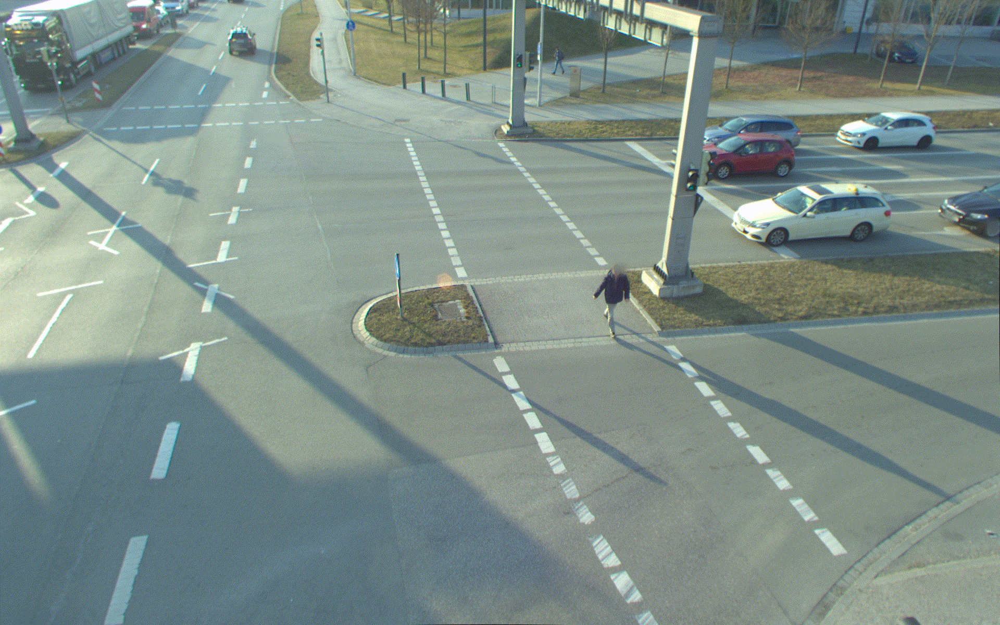

# TUM Traffic Dataset Development Kit

The TUM Traffic (`TUMTraf`) Dataset is based on roadside sensor data from the 3 km long  Providentia++ test field near Munich in Germany. The dataset includes anonymized and precision-timestamped multi-modal sensor and object data in high resolution, covering a variety of traffic situations. We provide camera and LiDAR frames from overhead gantry bridges with the corresponding objects labeled with 3D bounding boxes. The dataset contains the following subsets:
- TUM Traffic A9 Highway Dataset (`TUMTraf-A9`): Download [HERE](https://a9-dataset.com)
- TUM Traffic Intersection Dataset (`TUMTraf-I`): Download [HERE](https://innovation-mobility.com/tumtraf-dataset)
- TUM Traffic Cooperative Dataset (`TUMTraf-C`) -> will be available soon


The Development Kit provides a dataset loader for images, point clouds, labels and calibration data. The calibration loader reads the intrinsic and extrinsic calibration information. The projection matrix is then used to visualize the 2D and 3D labels on cameras images. 

## Installation
Create an anaconda environment:
```
conda create --name tum-traffic-dataset-dev-kit python=3.9
conda activate tum-traffic-dataset-dev-kit
```
Install the following dependencies:
```
conda install -c conda-forge fvcore
conda install -c conda-forge iopath
```
In case, you are using NVIDIA CUDA <11.6:
```
curl -LO https://github.com/NVIDIA/cub/archive/1.10.0.tar.gz
tar -xzf 1.10.0.tar.gz
export CUB_HOME=$PWD/cub-1.10.0
```
Install PyTorch3D:
```
pip3 install --no-index --no-cache-dir pytorch3d -f https://dl.fbaipublicfiles.com/pytorch3d/packaging/wheels/py39_cu113_pyt1121/download.html
```
Further information is available here: https://github.com/facebookresearch/pytorch3d/blob/main/INSTALL.md

Install requirements:

```
pip3 install -r requirements.txt
pip3 install --upgrade git+https://github.com/klintan/pypcd.git
```


## Internal Release History
The TUM Traffic Dataset contains the following releases:
* 2022-04: Released R00 TUM Traffic A9 Highway Dataset (`TUMTraf-A9`)  
* 2022-07: Released R01 TUM Traffic A9 Highway Dataset (`TUMTraf-A9`) extension with sequences from real accidents
* 2023-06: Released R02 TUM Traffic Intersection data (`TUMTraf-I`)
* 2023-12: Planning to release R03 TUM Traffic Cooperative Dataset (`TUMTraf-C`)

## Dataset Structure
#### 1) TUM Traffic A9 Highway Dataset (`TUMTraf-A9`) 
The TUM Traffic A9 Highway Dataset (`TUMTraf-A9`) contains 5 subsets (`s00` to `s04`) and is structured in the following way:

The first 3 sets `tum_traffic_a9_r00_s00`, `tum_traffic_a9_r00_s01` and `tum_traffic_a9_r00_s02` contain image data (`.png`) from roadside cameras with corresponding label files (stored in OpenLABEL `.json` format) and calibration data:
``` 
├── tum_traffic_a9_dataset_r00_s00
│   ├── _images
│   │   ├── s040_camera_basler_north_16mm
│   │   ├── s040_camera_basler_north_50mm
│   │   ├── s050_camera_basler_south_16mm
│   │   ├── s050_camera_basler_south_50mm
│   ├── _labels
│   │   ├── s040_camera_basler_north_16mm
│   │   ├── s040_camera_basler_north_50mm
│   │   ├── s050_camera_basler_south_16mm
│   │   ├── s050_camera_basler_south_50mm
│   ├── _calibration
│   │   ├── s040_camera_basler_north_16mm.json
│   │   ├── s040_camera_basler_north_50mm.json
│   │   ├── s050_camera_basler_south_16mm.json
│   │   ├── s050_camera_basler_south_50mm.json
```

The last two sets `tum_traffic_a9_r00_s03`, and `tum_traffic_a9_r00_s04` contain point cloud data (`.pcd`) from roadside LiDARs with corresponding label files (stored in OpenLABEL `.json` format) and calibration data:
``` 
├── tum_traffic_a9_dataset_r00_s03
│   ├── _points
│   ├── _labels
```


#### 2) TUM Traffic A9 Highway Dataset (`TUMTraf-A9`) extension with sequences from real accidents
The extended TUM Traffic A9 Highway Dataset additionally contains 3 subsets (`s01` to `s03`) and is structured in the following way:

Example: tum_traffic_a9_dataset_r01_s01:
``` 
├── tum_traffic_a9_dataset_r01_s03
│   ├── _images
│   │   ├── s040_camera_basler_north_16mm
│   │   ├── s040_camera_basler_north_50mm
│   │   ├── s050_camera_basler_south_16mm
│   │   ├── s050_camera_basler_south_50mm
│   ├── _labels
│   │   ├── s040_camera_basler_north_16mm
│   │   ├── s040_camera_basler_north_50mm
│   │   ├── s050_camera_basler_south_16mm
│   │   ├── s050_camera_basler_south_50mm
│   ├── _calibration
│   │   ├── s040_camera_basler_north_16mm.json
│   │   ├── s040_camera_basler_north_50mm.json
│   │   ├── s050_camera_basler_south_16mm.json
│   │   ├── s050_camera_basler_south_50mm.json
```

#### 3) TUM Traffic Intersection Dataset (`TUMTraf-I`)
The TUM Traffic Intersection Dataset (`TUMTraf-I`) contains 4 subsets (`s01` to `s04`) and is structured in the following way:

``` 
├── tum_traffic_intersection_dataset_r02_s01
│   ├── _images
│   │   ├── s110_camera_basler_south1_8mm
│   │   ├── s110_camera_basler_south2_8mm
│   ├── _labels
│   │   ├── s110_lidar_ouster_south
│   │   ├── s110_lidar_ouster_north
│   ├── _points_clouds
│   │   ├── s110_lidar_ouster_south
│   │   ├── s110_lidar_ouster_north
├── tum_traffic_intersection_dataset_r02_s02
│   ├── ...
├── tum_traffic_intersection_dataset_r02_s03
│   ├── ...
├── tum_traffic_intersection_dataset_r02_s04
│   ├── ...
```

## 1. Label Visualization
### 1.1 Visualization of labels in camera images 
The following visualization script can be used to draw the 2D and/or 3D labels on camera frames:

```
python tum-traffic-dataset-dev-kit/src/visualization/visualize_image_with_3d_boxes.py --camera_id s110_camera_basler_south1_8mm \
                                                                                      --lidar_id s110_lidar_ouster_south \
                                                                                      --input_folder_path_images <IMAGE_FOLDER_PATH> \
                                                                                      --input_folder_path_point_clouds <POINT_CLOUD_FOLDER_PATH> \
                                                                                      --input_folder_path_labels <LABEL_FOLDER_PATH> \
                                                                                      --viz_mode [box2d,box3d,point_cloud,track_history] \
                                                                                      --viz_color_mode [by_category,by_track_id] \
                                                                                      --output_folder_path_visualization <OUTPUT_FOLDER_PATH>
```
 


### 1.2 Visualization of labels in LiDAR point cloud scans
The script below draws labels on a LiDAR frame:

```
python tum-traffic-dataset-dev-kit/src/visualization/visualize_point_cloud_with_labels.py --input_folder_path_point_clouds <INPUT_FOLDER_PATH_POINT_CLOUDS> \
                                                                                          --input_folder_path_labels <INPUT_FOLDER_PATH_LABELS> \
                                                                                          --save_visualization_results \
                                                                                          --output_folder_path_visualization_results <OUTPUT_FOLDER_PATH_VISUALIZATION_RESULTS>
```


## 2. Image Undistortion/Rectification
The development kit also contains a script to undistort camera images:

```
python tum-traffic-dataset-dev-kit/src/preprocessing/undistort_images.py --input_folder_path_images ~/tum_traffic_a9_dataset_r00_s00/_images/s040_camera_basler_north_16mm \
                                                                         --file_path_calibration_parameter ~/tum_traffic_a9_dataset_r00_s00/_calibration/s40_camera_basler_north_16mm.json \
                                                                         --output_folder_path_images ~/tum_traffic_a9_dataset_r00_s00/_images_undistorted
```
An example between a distorted an undistorted image is shown below:


## 3. Point Cloud Pre-Processing

### 3.1 Point Cloud Registration

The following script can be used to register point clouds from two different LiDARs:
```
python tum-traffic-dataset-dev-kit/src/preprocessing/register_point_clouds.py --folder_path_point_cloud_source <INPUT_FOLDER_PATH_POINT_CLOUDS_SOURCE> \
                                                             --folder_path_point_cloud_target <INPUT_FOLDER_PATH_POINT_CLOUDS_TARGET> \
                                                             --save_registered_point_clouds \
                                                             --output_folder_path_registered_point_clouds <OUTPUT_FOLDER_PATH_POINT_CLOUDS>
```


### 3.2 Noise Removal
A LiDAR preprocessing module reduces noise in point cloud scans:

```
python tum-traffic-dataset-dev-kit/src/preprocessing/remove_noise_from_point_clouds.py --input_folder_path_point_clouds <INPUT_FOLDER_PATH_POINT_CLOUDS> \
                                                                                       --output_folder_path_point_clouds <OUTPUT_FOLDER_PATH_POINT_CLOUDS>
```


## 4. Label Conversion
In addition, a data converter/exporter enables you to convert the labels from OpenLABEL format into other formats like KITTI, COCO or YOLO and the other way round. 


### OpenLABEL to YOLO
The following script converts the OpenLABEL labels into YOLO labels:
```
python tum-traffic-dataset-dev-kit/src/converter/conversion_openlabel_to_yolo.py --input_folder_path_labels <INPUT_FOLDER_PATH_LABELS> \
                                                                                 --output_folder_path_labels <OUTPUT_FOLDER_PATH_LABELS>
```


## 5. Data Split
The script below splits the dataset into `train` and `val`:

```
python tum-traffic-dataset-dev-kit/src/preprocessing/create_train_val_split.py --input_folder_path_dataset <INPUT_FOLDER_PATH_DATASET> \
                                                                               --input_folder_path_data_split_root <INPUT_FOLDER_PATH_DATA_SPLIT_ROOT>
```


## 6. Evaluation Script
Finally, a model evaluation script is provided to benchmark your models on the A9-Dataset.
```
python tum-traffic-dataset-dev-kit/src/eval/evaluation.py --folder_path_ground_truth ${FILE/DIR} \
                                                          --folder_path_predictions ${FILE/DIR} \  
                                                          [--object_min_points ${NUM}]
```
Data format of predictions can be KITTI or OpenLABEL.
1) KITTI format: One `.txt` file per frame with the following content (one line per predicted object): class x y z l w h rotation_z.<br>
Example:
```
Car 16.0162 -28.9316 -6.45308 2.21032 3.74579 1.18687 2.75634
Car 17.926 -19.4624 -7.0266 1.03365 0.97037 0.435425 0.82854
```

2) [OpenLABEL](https://www.asam.net/index.php?eID=dumpFile&t=f&f=3876&token=413e8c85031ae64cc35cf42d0768627514868b2f) format: One `.json` file per frame. 

Example call to compare one ground truth file with one prediction file visually:
```
python tum-traffic-dataset-dev-kit/src/eval/evaluation.py --folder_path_ground_truth ~/tum_traffic_a9_dataset_r01_test/labels/1651673050_454284855_s110_lidar_ouster_south.json \
                                                          --folder_path_predictions ~/predictions/1651673050_454284855_s110_lidar_ouster_south.json \ 
                                                          --object_min_points 5
```
Example call to evaluate the whole set if ground truth bounding boxes enclose more than 5 points:
```
python tum-traffic-dataset-dev-kit/src/eval/evaluation.py --folder_path_ground_truth ~/tum_traffic_dataset_r01_test_set/labels \
                                                          --folder_path_predictions ~/detections \
                                                          --object_min_points 5
```
Final result when evaluating the [InfraDet3D](https://ieeexplore.ieee.org/document/10186723) camera-LiDAR fusion model on the TUM Traffic Intersection Dataset (test set):


|Class	           |Occurrence (pred/gt) |Precision|Recall |AP@0.1 |
|:-----------------|--------------------:|--------:|------:|------:|	
|CAR	           |2018/1003	         |71.75	   |87.33  |71.64  |	
|TRUCK	           |228/203	         |91.20	   |85.03  |91.03  |
|TRAILER	   |116/132	         |73.48	   |71.06  |72.95  |
|VAN		   |55/67	         |76.95	   |70.26  |76.48  |
|MOTORCYCLE	   |27/31	         |82.72	   |70.71  |82.37  |
|BUS		   |34/32	         |99.93	   |100.00 |99.93  |
|PEDESTRIAN	   |144/128              |31.37	   |25.49  |30.00  |
|BICYCLE	   |177/67	         |36.02	   |80.77  |35.93  |
|EMERGENCY_VEHICLE |1/0		         |0.00	   |0.00   |0.00   |
|OTHER		   |1/4			 |25.49	   |6.37   |24.00  |
|Total (10 classes)|2801/1704            |58.89	   |59.70  |58.43  |
|Total (6 classes) |2628/1464            |68.83	   |74.89  |**68.48** | 


The PointPillars model was trained on registered point clouds from 2 LiDARs with boxes that contain a minimum of 5 points. 
For the camera modality (MonoDet3D) only Car and Bicycle detections were processed. 

# License

The dataset itself is released under the [Creative Commons Attribution-NonCommercial-NoDerivatives 4.0 International License (CC BY-NC-ND 4.0)](https://creativecommons.org/licenses/by-nc-nd/4.0/). 
By downloading the dataset you agree to the [terms](https://a9-dataset.innovation-mobility.com/license) of this license.


The TUM Traffic Dataset Development Kit scripts are released under MIT license as found in the license file.

# Citation
@inproceedings{zimmer2023tumtraf,
  title={TUMTraf Intersection Dataset: All You Need for Urban 3D Camera-LiDAR Roadside Perception},
  author={Zimmer, Walter and Cre{\ss}, Christian and Nguyen, Huu Tung and Knoll, Alois C},
  publisher={IEEE},
  booktitle={2023 IEEE Intelligent Transportation Systems Conference (ITSC)},
  year={2023}
}

@inproceedings{zimmer2023infra,
  title={InfraDet3D: Multi-Modal 3D Object Detection based on Roadside Infrastructure Camera and LiDAR Sensors},
  author={Zimmer, Walter and Birkner, Joseph and Brucker, Marcel and Nguyen, Huu Tung and Petrovski, Stefan and Wang, Bohan and Knoll, Alois C.},
  publisher = {IEEE},
  booktitle={2023 IEEE Intelligent Vehicles Symposium (IV)},
  year={2023}
}

# Contact

Please feel free to contact us with any questions, suggestions or comments:

    Walter Zimmer (walter.zimmer@tum.de)
    Christian Creß (christian.cress@tum.de)
    Venkat Lakshmi (venkat.lakshmi@tum.de)
    Leah Strand (leah.strand@tum.de)
